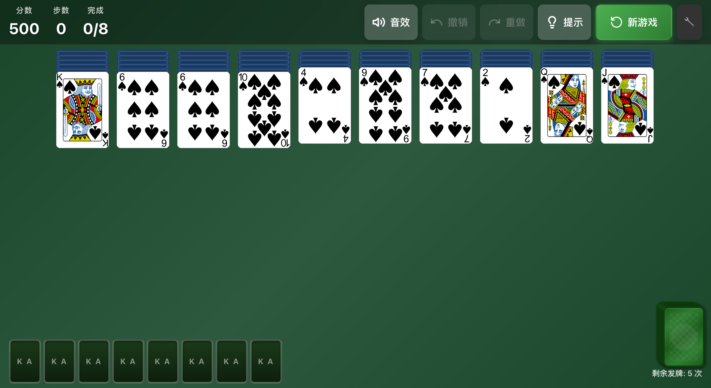

# 🕷️ 蜘蛛纸牌

> 经典 Windows 蜘蛛纸牌游戏的 Tauri 复刻版

[](https://tauri.app/)
[](https://www.rust-lang.org/)
[](https://svelte.dev/)

## 📸 游戏截图

<p align="center">
  
</p>

<p align="center">
  <em>高质量矢量扑克牌渲染 - 任意缩放都清晰锐利</em>
</p>

---

## ✨ 特性

- 🎮 **经典玩法** - 完整还原 Windows 蜘蛛纸牌规则
- 🚀 **极致轻量** - 安装包 < 10MB，冷启动 < 1秒
- 🖥️ **跨平台** - 支持 Windows / macOS / Linux
- 👴 **适老化设计** - 大字体、大按钮、清晰反馈
- 💾 **断点续玩** - 自动保存，随时继续
- 📊 **统计数据** - 记录胜率、最高分、最短用时
- 🎨 **矢量卡牌** - 高质量 SVG 渲染，任意缩放都清晰
- ✅ **质量保证** - 1000次洗牌模拟测试，确保牌组永远正确

---

## 📥 下载安装

[](https://github.com/leoomo/Classic_Spider/releases/download/v0.1.0/Classic.Spider_0.1.0_x64-setup.exe)

> [点击下载 Windows 版](https://github.com/leoomo/Classic_Spider/releases/download/v0.1.0/Classic.Spider_0.1.0_x64-setup.exe) · macOS / Linux 即将推出

---

## 📖 文档

- [产品需求文档 (PRD)](./docs/PRD.md) - 完整的产品规格说明
- [技术架构文档](./docs/ARCHITECTURE.md) - Rust 后端与 Svelte 前端实现指南

---

## 🎯 游戏规则

### 难度等级

| 难度 | 花色 | 适合人群 |
|------|------|----------|
| 初级 | 单色（黑桃） | 新手入门 |
| 中级 | 双色（黑桃+红桃） | 进阶玩家 |
| 高级 | 四色 | 高手挑战 |

### 基本操作

1. **移动卡牌** - 点击选中，再点击目标位置；或直接拖拽
2. **发牌** - 点击右下角发牌堆（所有列不能为空）
3. **撤销** - 支持无限次撤销
4. **提示** - 自动寻找可移动的牌

### 胜利条件

将所有卡牌按 K→A 的顺序组成 8 组完整同花色序列。

---

## 🛠️ 技术栈

| 层级 | 技术 | 用途 |
|------|------|------|
| 应用框架 | [Tauri 2.x](https://tauri.app/) | 原生窗口、跨平台 |
| 后端逻辑 | [Rust](https://www.rust-lang.org/) | 游戏核心、状态管理 |
| 前端框架 | [Svelte 5](https://svelte.dev/) | UI 渲染、动画 |
| 样式方案 | [TailwindCSS 4.x](https://tailwindcss.com/) | 快速样式开发 |
| 测试覆盖 | Rust 内置测试 | 1000次洗牌验证、规则测试 |

---

## 📦 项目结构

```
classic-spider/
├── src-tauri/          # Rust 后端
│   ├── src/
│   │   ├── game/       # 游戏逻辑
│   │   ├── commands/   # Tauri 命令
│   │   └── storage/    # 数据持久化
│   └── Cargo.toml
│
├── src/                # Svelte 前端
│   ├── lib/
│   │   ├── components/ # UI 组件
│   │   ├── stores/     # 状态管理
│   │   └── utils/      # 工具函数
│   └── assets/         # 静态资源
│
└── docs/               # 文档
    ├── PRD.md
    └── ARCHITECTURE.md
```

---

## 🚀 快速开始

### 环境要求

- Node.js 18+
- Rust 1.75+
- pnpm / npm / yarn

### 安装依赖

```bash
# 安装前端依赖
pnpm install

# Rust 依赖会在首次构建时自动安装
```

### 开发模式

```bash
pnpm tauri dev
```

### 构建发布

```bash
pnpm tauri build
```

---

## 🎨 设计理念

### 针对老年用户优化

- **大字体大按钮** - 最小点击区域 44x44px
- **高对比度** - 经典深绿桌面 + 白色卡牌
- **清晰反馈** - 选中高亮、悬停效果
- **经典风格** - 拟物化设计，唤醒怀旧记忆

---

## 📋 开发进度

- [x] Phase 1: 基础架构
  - [x] Tauri 2.x 项目初始化
  - [x] Rust 核心数据结构（Card, Deck, GameState）
  - [x] Svelte 5 前端脚手架

- [x] Phase 2: 核心玩法
  - [x] 拖拽系统（点击选中 + 拖拽移动）
  - [x] 移动规则验证（同花色降序）
  - [x] 发牌逻辑（10列各发1张）
  - [x] 收牌逻辑（K→A完整序列自动回收）

- [x] Phase 3: 完善体验
  - [x] 撤销/重做系统
  - [x] 动画效果（卡牌移动、发牌）
  - [x] 音效系统
  - [x] 胜利检测与庆祝动画

- [x] Phase 4: 打磨发布
  - [x] 统计数据（胜率、分数、用时）
  - [x] 断点续玩（自动保存）
  - [x] GitHub Actions 自动发布
  - [x] 跨平台打包（Windows / macOS / Linux）

- [ ] Phase 5: 持续优化
  - [ ] 提示系统（自动寻找可移动牌）
  - [ ] 更多主题选择
  - [ ] 多语言支持

---

## 📄 License

MIT License

---

*致敬经典，重现美好回忆* 🕷️
