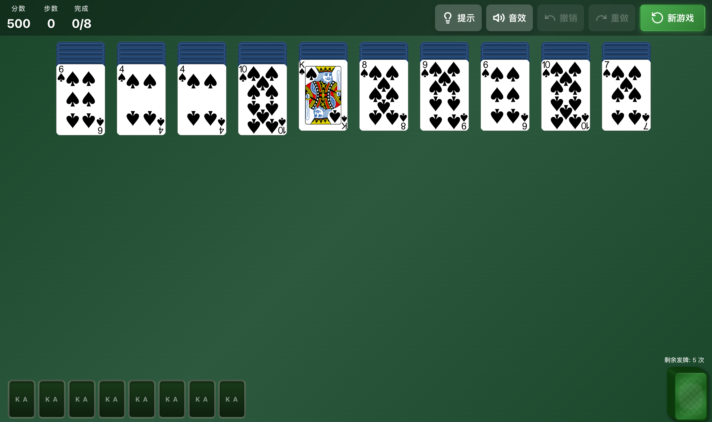

# 🕷️ Classic Spider Solitaire

> A Tauri recreation of the classic Windows Spider Solitaire

[](https://tauri.app/)
[](https://www.rust-lang.org/)
[](https://svelte.dev/)

English | [简体中文](./README.zh-CN.md)

## 📸 Screenshot

<p align="center">
  
</p>

<p align="center">
  <em>High-quality vector playing cards — razor sharp at any zoom level</em>
</p>

---

## ✨ Features

- 🎮 **Classic Gameplay** — Faithful recreation of Windows Spider Solitaire rules
- 🚀 **Ultra Lightweight** — Installer < 10MB, cold start < 1s
- 🖥️ **Cross-Platform** — Windows / macOS / Linux
- 👴 **Senior-Friendly** — Large fonts, big buttons, clear feedback
- 💾 **Resume Anytime** — Auto-save, pick up where you left off
- 📊 **Statistics** — Track win rate, high score, best time
- 🎨 **Vector Cards** — High-quality SVG rendering, sharp at any scale
- ✅ **Quality Assured** — 1,000-shuffle simulation test ensures correct deck every time

---

## 📥 Download

[](https://github.com/leoomo/Classic_Spider/releases/latest)

> [Download Latest Release](https://github.com/leoomo/Classic_Spider/releases/latest) · Supports Windows / macOS

---

## 📖 Documentation

- [Product Requirements Document (PRD)](./docs/PRD.md) — Full product specification
- [Architecture Document](./docs/ARCHITECTURE.md) — Rust backend & Svelte frontend implementation guide

---

## 🎯 Game Rules

### Difficulty Levels

| Level | Suits | Best For |
|-------|-------|----------|
| Easy | 1 suit (Spade) | Beginners |
| Medium | 2 suits (Spade + Heart) | Intermediate players |
| Hard | 4 suits | Experts |

### Basic Controls

1. **Move cards** — Tap to select, then tap destination; or drag and drop
2. **Deal** — Click the stock pile at bottom-right (no column can be empty)
3. **Undo** — Unlimited undos (Shortcut: Ctrl+Z)
4. **Redo** — Redo after undo (Shortcut: Ctrl+Y)
5. **Hint** — Automatically finds movable cards

### Win Condition

Form 8 complete same-suit sequences from K→A to collect all cards.

---

## 🛠️ Tech Stack

| Layer | Technology | Purpose |
|-------|------------|---------|
| App Framework | [Tauri 2.x](https://tauri.app/) | Native window, cross-platform |
| Backend Logic | [Rust](https://www.rust-lang.org/) | Game core, state management |
| Frontend Framework | [Svelte 5](https://svelte.dev/) | UI rendering, animations |
| Styling | [TailwindCSS 4.x](https://tailwindcss.com/) | Rapid styling |
| Testing | Rust built-in tests | 1,000-shuffle validation, rule tests |

---

## 📦 Project Structure

```
classic-spider/
├── src-tauri/          # Rust backend
│   ├── src/
│   │   ├── game/       # Game logic
│   │   ├── commands/   # Tauri commands
│   │   └── storage/    # Data persistence
│   └── Cargo.toml
│
├── src/                # Svelte frontend
│   ├── lib/
│   │   ├── components/ # UI components
│   │   ├── stores/     # State management
│   │   └── utils/      # Utilities
│   └── assets/         # Static assets
│
└── docs/               # Documentation
    ├── PRD.md
    └── ARCHITECTURE.md
```

---

## 🚀 Quick Start

### Prerequisites

- Node.js 18+
- Rust 1.75+
- pnpm / npm / yarn

### Install Dependencies

```bash
# Install frontend dependencies
pnpm install

# Rust dependencies will be installed automatically on first build
```

### Development Mode

```bash
pnpm tauri dev
```

### Build for Production

```bash
pnpm tauri build
```

---

## 🎨 Design Philosophy

### Optimized for Elderly Users

- **Large fonts & big buttons** — Minimum click area 44×44px
- **High contrast** — Classic dark-green table + white cards
- **Clear feedback** — Selection highlight, hover effects
- **Classic style** — Skeuomorphic design evokes nostalgia

---

## 📋 Development Roadmap

- [x] Phase 1: Foundation
  - [x] Tauri 2.x project initialization
  - [x] Rust core data structures (Card, Deck, GameState)
  - [x] Svelte 5 frontend scaffolding

- [x] Phase 2: Core Gameplay
  - [x] Drag system (tap-to-select + drag-to-move)
  - [x] Move rule validation (same suit, descending sequence)
  - [x] Deal logic (1 card to each of 10 columns)
  - [x] Collect logic (K→A complete sequence auto-collected)

- [x] Phase 3: Experience Polish
  - [x] Undo / Redo system
  - [x] Animations (card moves, dealing)
  - [x] Sound effects
  - [x] Win detection and celebration

- [x] Phase 4: Release Polish
  - [x] Statistics (win rate, score, time)
  - [x] Save & resume (auto-save)
  - [x] GitHub Actions automated release
  - [x] Cross-platform packaging (Windows / macOS / Linux)

- [ ] Phase 5: Continuous Improvement
  - [x] Hint system (auto-find movable cards)
  - [ ] More themes
  - [ ] Multi-language support

---

## 📄 License

MIT License

---

*A tribute to the classic, recreating fond memories* 🕷️
